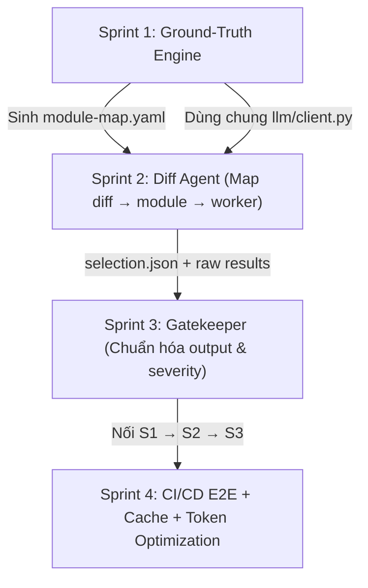

# KẾ HOẠCH TRIỂN KHAI (4 SPRINT) — QC-AGENT v2

Tài liệu này xác định chi tiết lộ trình kỹ thuật, các quyết định kiến trúc, danh sách file, task con và tiêu chuẩn nghiệm thu (Definition of Done) cho 4 Sprint của hệ thống QC-Agent.

---

## Trạng thái hiện tại (cập nhật 2026-10-03)

Kiến trúc đích nằm ở [architecture.md](architecture.md); bảng này ghi code đã tới đâu. Nhãn:
*Đã chạy* (có code + test) · *Đã chạy — chưa đo bằng model thật* (DoD phần LLM chờ số đo) · *Chưa làm* (đã chốt trong plan).

| Thành phần | Trạng thái | Ghi chú |
|---|---|---|
| Gate tất định `core/` (plan → worker → verdict → report) | *Đã chạy* | Verdict mới `BLOCKED` / `PASSED_WITH_WARNINGS` / `PASSED` (S3, commit `c883532`) |
| Worker `schemathesis`, `k6`, `midscene`, `pytest`, `semgrep`, `gitleaks`, `trivy`, `coverage-debt` | *Đã chạy* | Security chạy trong image, chưa có PR thật. `deepeval` chưa chạy trên sản phẩm thật |
| Worker `playwright` (integration) | Worker + scaffold đã có | Chưa spike với SUT có browser extension (request từ service worker), chưa có PR thật ([worker.md](worker.md)) |
| `llm/client.py` + `agent_loop.py` (Claude, Gemini) | *Đã chạy — chưa đo bằng model thật* | Agent GT chưa từng gọi API Anthropic thật. `count_tokens`, prompt caching, trần token: chưa làm (S4) |
| Ground-Truth: parse PRD, sinh catalog, render, `gt generate / validate / regen`, agent đọc repo, bộ chấm coverage, Excel | *Đã chạy — chưa đo bằng model thật* | DoD S1 còn 2 mục PENDING bên dưới |
| Workflow sinh GT + khoá `.qc-agent/**` | Đã có workflow, mẫu CODEOWNERS, `tools/protect_ground_truth.py` | Chưa chạy trên GitHub thật, chưa bật protection trên repo thật |
| Trigger `manual` + `--trigger`; Selector (prune, path rules, Diff Agent, floor); Task Runner song song | *Đã chạy* (S2) | Recall/precision/P95 với Haiku thật chưa đo. Executor/dashboard chưa nối `--trigger manual --workers` (phạm vi = toàn bộ policy). `max_parallel` mặc định 1 |
| Contract 2.0.0, normalizer (`core/findings.py`), `pr_review`, Jira cho finding Low, gỡ sổ nợ | Đã có code + test (S3) | DoD S3 chưa tick; cần bằng chứng harness fake GitHub/Jira như S1/S2 |
| Cache selection + GT, prompt caching, trần token, E2E trên CI thật, runbook | *Chưa làm* (S4) | |
| Bước `refine` trên PR (`continue-on-error`, chỉ đề xuất) | Giữ nguyên | Ngoài v2, không có quyền chặn |

---

## 0. Chốt lại quyết định và hệ quả kỹ thuật

| # | Bạn chốt | Hệ quả khi làm |
|---|---|---|
| **1** | **Floor secrets + sast** | Floor có hai lớp chặn. Selector gộp floor vào lựa chọn, và `core/` gộp lại lần nữa, nên dù `selection.json` bị sửa tay, floor vẫn chạy. |
| **2** | **`.qc-agent/ground-truth/` nằm song song `suites/`** | Không đụng các worker hiện có. |
| **3** | **`high` đổi thành `critical`** | Bỏ một giá trị enum là thay đổi phá vỡ (breaking change), nên contract phải nâng `1.0.0` lên `2.0.0` (MAJOR) và cần $\ge 1$ người trong nhóm core ở `.github/contract-reviewers.yaml` duyệt. Gộp luôn `findings[].location` (field tùy chọn) vào cùng lần nâng này để khỏi nâng hai lần. Có 11 chỗ đang phát `high` phải sửa cùng một PR (danh sách ở S3.1). |
| **4** | **Postgres: không dùng, không bỏ** | Không viết migration drop. Bảng `test_debt`, migration `0005`, `models.py` giữ nguyên, chỉ gỡ khỏi luồng. Luồng PR và luồng manual (CLI/`workflow_dispatch`) phải chạy được khi không có `QC_DATABASE_URL`. |
| **5** | **Sonnet 5 / Haiku 4.5** | Dùng `claude-sonnet-5` cho GT Generator và `claude-haiku-4-5-20251001` cho Diff Agent. Gọi qua `httpx` (đã có trong dependency, cùng kiểu với `scaffold/suggest.py`), không thêm SDK. |

---

## 1. Thứ tự phụ thuộc giữa các Sprint



---

## 2. "Đạt 90%" đo bằng gì?

Con số 90% chỉ có ý nghĩa khi có một tập chuẩn (Golden Set) để đo. Mỗi sprint có một golden set do QA gán nhãn và một script đo định lượng:

| Sprint | Thước đo chính | Ngưỡng | Công cụ đo |
|---|---|---|---|
| **S1** | Tỉ lệ Acceptance Criteria trong PRD mẫu có $\ge 1$ test case trỏ tới (AC coverage) | $\ge 90\%$ | `tools/eval_groundtruth.py` |
| **S1** | Tỉ lệ mutant nghiệp vụ bị suite đã duyệt bắt được | $\ge 90\%$ | Cùng script trên, chạy toy app |
| **S2** | Recall khi chọn worker: không bỏ sót worker cần chạy (chỉ tính phần LLM) | $\ge 90\%$ | `tools/eval_selector.py` |
| **S3** | Tỉ lệ finding có vị trí được comment đúng dòng | $\ge 90\%$ | Test fixture |
| **S4** | Số lần chạy trọn chuỗi E2E trên CI thật xanh liên tiếp | $\ge 9/10$ | Runbook |

> [!IMPORTANT]
> **Phần tất định phải đạt 100%:** manual trigger, fallback, bảng severity, floor, chống prompt injection.  
> Mức 90% chỉ áp dụng cho phần có LLM.

### Điều kiện chung (Sprint nào cũng phải đạt):
- `pytest -q` xanh.
- `python tools/freeze_contract.py --check` exit 0.
- `demo.yaml` exit 0 và `demo_fail.yaml` exit 1.
- Log không chứa nội dung PRD, diff hay secret (có test bắt log).

---

## Sprint 1: Vòng ngoài (Ground-Truth Engine)

> **Mục tiêu:** BA đưa PRD vào, LLM sinh test case và suite nháp rồi mở PR. QA thêm edge case, đổi `draft` thành `approved` rồi merge. Thư mục `.qc-agent/**` trên `main` bị khóa, chỉ QA sửa được.  
> **Nguyên tắc thiết kế:** LLM chỉ sinh dữ liệu có cấu trúc (JSON test case). Code test được render từ template một cách tất định. QA vì vậy duyệt dữ liệu thay vì duyệt code do LLM viết, giảm thiểu tối đa lỗi LLM bịa code.

### Danh sách Files

#### File Mới:
- `src/qc_agent/llm/__init__.py`, `src/qc_agent/llm/client.py`: gọi Messages API, ép JSON bằng tool-use, ghi egress, đếm token.
- `src/qc_agent/groundtruth/{__init__.py, prd.py, generate.py, render.py, cli.py}`
- `src/qc_agent/groundtruth/prompts/gt_generate.md`
- `schemas/ground_truth.json` (catalog TC), `schemas/module_map.json` (schema dữ liệu, không nằm trong `CONTRACT.lock`).
- `workers/pytest.yaml` + `src/qc_agent/adapters/pytest_adapter.py` (đọc JUnit XML, capability `api.functional`).
- `src/qc_agent/scaffold/tmpl/{gt-api-functional.py.tmpl, CODEOWNERS.tmpl, qc-groundtruth.yml.tmpl}`
- `.github/workflows/qc-groundtruth.reusable.yml`: sinh GT rồi mở PR `qc-agent/gt/<prd-id>`.
- `tools/protect_ground_truth.py` (bật branch protection + bắt buộc review của code owner qua API).
- `tools/eval_groundtruth.py`
- `tests/fixtures/prd/{noteboard-prd.md, noteboard-golden.yaml}`
- `tests/fixtures/llm/gt_noteboard_response.json` (response đã ghi lại).
- `tests/test_llm_client.py`, `tests/test_gt_prd.py`, `tests/test_gt_generate.py`, `tests/test_gt_render.py`, `tests/test_gt_cli.py`, `tests/test_pytest_adapter.py`.
- `docs/groundtruth.md`

#### File Sửa:
- `docs/architecture.md`, `docs/core-rules.md`, `CLAUDE.md` (áp Phần 1). `docs/phase2/plan-debt.md` (đã Superseded) nay đã xóa khỏi repo, xem `git log -- docs/phase2`.
- `src/qc_agent/core/cli.py`: thêm lệnh `gt`, import lười như init để `core/` không kéo LLM vào.
- `src/qc_agent/scaffold/{validate.py, init.py, templates.py}`
- `schemas/capabilities.json` (thêm `api.functional`).
- `src/qc_agent/settings.py` + `.env.example`: `ANTHROPIC_API_KEY`, `QC_GT_MODEL`, `QC_SELECTOR_MODEL`, `QC_LLM_TIMEOUT_S`.
- `tests/fixtures/sut/noteboard/toyapp/app.py`: thêm mutant nghiệp vụ `BUG-4…BUG-13` bật qua `QC_BUGS`.
- `tests/fixtures/sut/noteboard/.qc-agent/ground-truth/`: bản GT đã duyệt, dùng làm mẫu.

### Task con

- [x] **S1.0:** Viết lại `architecture.md`, `core-rules.md`, `CLAUDE.md` theo Phần 1. Làm trước để code và tài liệu không mâu thuẫn nhau.
- [x] **S1.1 (`llm/client.py`):**
  - `temperature=0`, timeout lấy từ settings.
  - Ép output qua tool-use `input_schema`.
  - Ghi `core/egress.record()` trước khi gửi (policy deny thì không gửi).
  - Trả usage (số token) cho caller.
  - Khi lỗi, exception không kèm nội dung response.
- [x] **S1.2 (`prd.py` parse PRD):**
  - Markdown: chia theo heading, nhận diện các khối "User Story" và "AC".
  - OpenAPI: lấy endpoint và ràng buộc bằng code tất định, dùng lại `scaffold/openapi.py`.
  - Text thô: fallback thành một khối duy nhất.
  - Tính `prd_sha256` để về sau cache.
- [x] **S1.3:** Viết `schemas/ground_truth.json`. Mỗi TC có `tc_id`, `ac_refs[]`, `kind` (`api_contract` | `api_functional` | `flow`), `status` (`draft` | `approved` | `rejected`), `request`, `expect`, `origin` (`llm` | `qa`).
- [x] **S1.4 (`generate.py`):** Gửi PRD đã parse và danh sách endpoint, nhận TC JSON, validate theo schema. Nếu sai schema thì cho LLM sửa một lần, vẫn sai thì exit 3. Không có AC nào "mồ côi" (thiếu TC) mà không bị báo.
- [x] **S1.5 (`render.py`, tất định):**
  - Sinh `test-cases.yaml` (bản cho người đọc).
  - Sinh `tests_gt/test_<story>.py` bằng template pytest.
  - Sinh suite `api-contract` (`schemathesis`) và suite `gt-functional` (`pytest`).
  - Sinh `module-map.yaml` nháp (glob đường dẫn $\to$ module $\to$ suite).
  - Mọi thứ sinh ra mang `status: draft`.
- [x] **S1.6 (Worker `pytest`):** Manifest + adapter chỉ override `build_cmd`/`parse_output`. Không sửa `core/`.
- [x] **S1.7 (CLI):** `qc-agent gt generate --prd … --sut-root …`, `gt validate`, `gt regen`. Khi PRD đổi, `gt regen` merge theo `tc_id`: không bao giờ ghi đè TC `approved` hoặc `origin: qa`.
- [x] **S1.8 (HITL):**
  - Workflow mở PR sinh GT.
  - QA đổi `draft` thành `approved` và thêm edge case (`origin: qa`).
  - `gt validate` chạy trong CI của PR đó và exit 1 nếu còn `draft`.
  - Gate chỉ chạy TC `approved`.
- [x] **S1.9 (Khóa main):**
  - `init` sinh `CODEOWNERS` với `/.qc-agent/ @<qa-team>`.
  - `tools/protect_ground_truth.py` bật `require_code_owner_reviews`.
  - Viết hướng dẫn trong `docs/groundtruth.md`.
- [x] **S1.10 (`eval_groundtruth.py`):**
  - Đo AC coverage so với golden.
  - Đo tỉ lệ TC chạy xanh trên toy app sạch (`QC_BUGS=none`).
  - Đo tỉ lệ bắt mutant.

### DoD Sprint 1
- [x] Với fake LLM, `gt generate` trên PRD mẫu cho ra đúng bộ file golden. Chạy lại 2 lần cho ra byte giống hệt nhau.
- [ ] Với LLM thật (median của 3 lần chạy): AC coverage $\ge 90\%$, và $\ge 90\%$ TC sinh ra chạy xanh trên toy app sạch. **PENDING (chưa tick):** cần chạy `tools/eval_gt_sut.py --llm real --runs 3 --yes` trên SUT thật với Gemini (tốn quota, gửi PRD ra ngoài: chờ người dùng chạy và xác nhận).
- [x] Sau khi QA duyệt: suite bắt được $\ge 9/10$ mutant (`BUG-4…BUG-13`) và vẫn bắt được `BUG-1`.
- [x] `gt regen` sau khi sửa PRD giữ nguyên 100% TC `approved` và `origin: qa` (có test).
- [ ] `gt validate` exit 1 khi còn draft. Qua fake GitHub, xác nhận script protect bật đúng `require_code_owner_reviews`. Kiểm tay một lần trên repo thật: tài khoản không phải QA push vào `.qc-agent/` thì bị từ chối. **PENDING (chưa tick):** đã có bằng chứng cho `gt validate` exit 1 (`test_gt_cli.py`) và script protect qua fake GitHub (`test_protect_ground_truth.py`); còn thiếu kiểm tay trên repo thật (cần repo, secret và branch protection do người dùng cấu hình; dự kiến S4-06).
- [x] Egress bị deny thì không có HTTP call nào. `egress.jsonl` có dòng ghi lại. Log không chứa nội dung PRD.
- [ ] *Ngoài phạm vi:* assertion đọc thẳng DB của SUT chỉ làm dạng hộp đen (gọi API rồi đọc lại qua API).

---

## Sprint 2: Lõi Orchestrator (Hai trigger + Diff Analysis Agent)

> **Mục tiêu:** Trigger `manual` chạy đúng worker được chỉ định mà không có LLM. Trigger `pr` đi qua các bước: `prune` $\to$ `path rules` $\to$ `Diff Agent` $\to$ `floor` $\to$ `Task Runner`. LLM lỗi thì chạy FULL SET, không bao giờ làm tắc gate.

### Định dạng `selection.json` (File duy nhất LLM được ảnh hưởng tới)
```json
{
  "trigger_type": "pr",
  "diff_sha256": "…",
  "source": "llm",
  "floor": ["gitleaks", "semgrep"],
  "workers": ["schemathesis", "pytest"],
  "suites": ["secrets", "sast", "api-contract", "gt-functional"],
  "rationale": {
    "schemathesis": "đổi routes/notes.py → module notes"
  },
  "fallback_reason": null,
  "llm": {
    "model": "claude-haiku-4-5-20251001",
    "input_tokens": 3120
  }
}
```

### Danh sách Files

#### File Mới:
- `src/qc_agent/selector/{__init__.py, payload.py, pruner.py, rules.py, agent.py, cli.py}`
- `src/qc_agent/selector/prompts/diff_select.md`
- `schemas/selection.json`
- `tests/fixtures/diffs/*.patch` ($\ge 30$ diff đã gán nhãn) + `labels.yaml`
- `tests/fixtures/diffs/injection/*.patch` ($\ge 10$)
- `tools/eval_selector.py`
- `tests/test_selector_{payload,pruner,rules,agent}.py`, `tests/test_trigger_manual.py`, `tests/test_floor_enforced.py`

#### File Sửa:
- `src/qc_agent/core/cli.py`: `--trigger pr|manual`, `--workers a,b`, `--selection FILE`, thêm lệnh `qc-agent select` (import lười).
- `src/qc_agent/core/engine.py` (`run_project`): đổi selection thành `only_suites`, gộp lại floor, ghi `selection.json` vào `run_dir` và hash vào `plan_id`.
- `src/qc_agent/core/project.py` (`build_plan`, schema policy): thêm key `floor_workers`, `full_set_paths`, `max_parallel`, map worker $\to$ suite.
- `src/qc_agent/core/registry.py`: tra ngược worker $\leftrightarrow$ capability.
- `src/qc_agent/core/runner.py`: chạy song song các task cùng tầng toposort theo `max_parallel`.
- `src/qc_agent/core/report.py`: thêm mục "Phạm vi chạy" (nguồn chọn, lý do, fallback).
- `configs/projects/_default.yaml`, `configs/projects/noteboard.yaml`
- `.github/workflows/qc-gate.reusable.yml`: thêm bước Select trước gate, diff base = `pull_request.base.sha`, `workflow_dispatch` có input workers.
- `docs/usage-ci.md`

### Task con

- [x] **S2.1 (`payload.py`):** `TriggerPayload`. Manual thì validate tên worker theo registry và policy (sai tên exit 3), và không import `selector.agent`.
- [x] **S2.2 (`pruner.py`):**
  - Chạy `git diff -w base..head`.
  - Bỏ file binary, lockfile, file generated/vendor.
  - Bỏ hunk chỉ đổi comment hoặc format.
  - Đặt giới hạn token cho từng file và cho tổng.
  - Danh sách file luôn đầy đủ, kể cả khi hunk bị cắt.
- [x] **S2.3 (`rules.py`):** Diff khớp `full_set_paths` thì chạy FULL SET (không gọi LLM). Diff chỉ chạm docs thì chỉ chạy floor. Tra `module-map.yaml` tất định để có gợi ý.
- [x] **S2.4 (`agent.py`):**
  - Prompt gồm `module-map`, catalog worker được phép, và diff đặt trong vùng phân cách.
  - Tool-use với enum = allowlist worker.
  - Timeout 20s.
  - 5 loại lỗi dẫn đến FULL SET: timeout, 5xx/quota, JSON sai, worker lạ, thiếu API key.
- [x] **S2.5:** Floor chặn hai lớp: selector gộp floor, và engine gộp lại lần nữa.
- [x] **S2.6:** Nối vào engine. `--rerender` dựng lại được đúng phạm vi đã chọn nhờ selection nằm trong plan.
- [x] **S2.7:** Chạy song song theo tầng toposort. Phải giữ nguyên thứ tự các task có `depends_on`.
- [x] **S2.8:** Golden set $\ge 30$ diff trên noteboard, gồm các loại: đổi API, đổi UI, chỉ docs, Dockerfile, lockfile, file nhạy cảm bảo mật, diff trộn. `eval_selector.py` in ra recall và precision.
- [x] **S2.9:** $\ge 10$ diff chứa prompt injection (kiểu ví dụ ở §5.3 cũ).
- [x] **S2.10:** Bước Select trong workflow, và `workflow_dispatch` cho manual.

### DoD Sprint 2
- [x] Manual (100%): `--trigger manual --workers semgrep,schemathesis` chạy đúng các suite tương ứng và không suite nào khác. Test chặn network xác nhận không có lời gọi LLM nào. *Bằng chứng:* `tests/test_trigger_manual.py` (chặn `socket.connect`, kiểm `qc_agent.llm` và `qc_agent.selector.agent` không bị import, `floor == []`).
- [ ] PR: Diff Agent (chỉ phần LLM, median 3 lần) đạt recall $\ge 90\%$, precision $\ge 80\%$ trên golden set. Recall cuối (sau khi gộp floor và rules) = $100\%$ với nhóm file cốt lõi và nhóm bảo mật. **PENDING (chưa tick):** `tools/eval_selector.py --llm fake --runs 3` chỉ chứng minh đường ống và công thức đo (đạt 1.0 vì fake trả đúng nhãn), không đo chất lượng model. Cần chạy `--llm real --runs 3 --yes` (tốn quota, gửi diff ra ngoài: chờ người dùng chạy và xác nhận).
- [x] Fallback (100%): cả 5 loại lỗi đều cho FULL SET, có `fallback_reason`, gate không ra error. *Bằng chứng:* `tests/test_selector_agent.py` (timeout, 5xx/quota, JSON sai, worker lạ, thiếu API key, thêm `egress_denied`) và `tests/test_selector_cli.py` (thiếu key → `select` exit 0, `full_set`, `fallback_reason=missing_api_key`).
- [x] Injection (100%): 10/10 case vẫn chạy floor, verdict không đổi. Sửa tay `selection.json` để bỏ floor thì core vẫn chạy floor. *Bằng chứng:* `tests/test_selector_golden.py` (10 diff injection, LLM giả chọn rỗng vẫn giữ floor), `tools/eval_selector.py --llm fake --runs 3` (`injection_pass` 30/30, so với bản sạch tương ứng), `tests/test_floor_enforced.py` (selection không có floor, core tự bổ sung `sast`, `secrets`).
- [x] Diff chỉ docs thì chỉ chạy floor. Diff chạm Dockerfile thì FULL SET và không gọi LLM. *Bằng chứng:* `tests/test_selector_agent.py::test_rules_short_circuit_http` (HTTP bị chặn bằng `AssertionError`), `tests/test_selector_golden.py`, `tests/test_selector_cli.py` (docs → `source=rules`, `suites=[sast, secrets]`).
- [x] `selection.json` có trong artifact, lý do chọn hiện trong report. *Bằng chứng:* engine ghi `selection.json` vào `run_dir`, workflow upload `runs/`; `tests/test_floor_enforced.py::test_report_and_rerender_keep_enforced_scope` kiểm mục "Phạm vi chạy" và `--rerender`.
- [ ] Bước Select có P95 $\le 20s$. **PENDING (chưa tick):** bản fake đo được P95 ≈ 0,4s nhưng không tính độ trễ API; cần số đo với LLM thật (cùng lần chạy `--llm real` ở trên).

---

## Sprint 3: Output & Gatekeeper

> **Mục tiêu:** Chuẩn hóa mọi finding về dạng `{severity, path, line, fingerprint}`. Có Critical/Medium hoặc worker error/skipped thì `BLOCKED`. Chỉ có Low thì `PASSED_WITH_WARNINGS`. Gắn inline comment lên PR, tạo ticket Jira cho lỗi Low. Gỡ sổ nợ khỏi luồng nhưng giữ Postgres.

### Lõi của Gatekeeper (Hàm thuần tất định 100%)
```python
def gate_verdict(findings, infra_blockers, block_on=("critical", "medium")) -> GateVerdict:
    if infra_blockers or any(f.severity in block_on for f in findings):
        return GateVerdict(BLOCKED, 1, ...)
    if findings:                       # chỉ còn Low
        return GateVerdict(PASSED_WITH_WARNINGS, 0, ...)
    return GateVerdict(PASSED, 0, ...)
```

### Danh sách Files

#### Thay đổi Contract:
- `schemas/result.json`: `severity_hint` $\in$ `{low, medium, critical}`, thêm `findings[].location` `{path, line?, end_line?}` (tùy chọn).
- `schemas/CONTRACT.lock`: nâng lên `2.0.0` qua `freeze_contract.py --write --version 2.0.0`.

#### File Mới:
- `src/qc_agent/core/findings.py`: Normalizer, tính fingerprint không chứa số dòng để khỏi lệch khi code dịch dòng.
- `src/qc_agent/integrations/pr_review.py`: tổng quát hóa `security_review.py` cho mọi worker.
- `src/qc_agent/integrations/jira.py`: client REST v3, `sync_low_findings`, chống trùng bằng label `qcagent-<fingerprint>`.
- `tests/test_findings_normalize.py`, `tests/test_gatekeeper.py`, `tests/test_pr_review.py`, `tests/test_jira_sync.py` (fake Jira bằng `httpx.MockTransport`).
- `tests/fixtures/results/*.json`

#### File Sửa:
- **Sửa phát `high` (S3.1):** `adapters/{_security.py, semgrep_adapter.py, trivy_adapter.py, gitleaks_adapter.py, playwright_adapter.py, deepeval_adapter.py, coverage_debt_adapter.py}`, `oracle/{checks.py, threshold.py, signals.py}`, `integrations/security_review.py`.
- **Sửa Lõi:** `core/verdict.py` (viết lại), `core/engine.py` (judge), `core/cli.py` (`--warn-exit`, giữ `--yellow-exit` làm alias deprecated), `core/report.py` (nhóm theo severity), `core/project.py` (bỏ `_check_yellow_subset`/`advisory_yellow_suites`, thêm severity policy + `default_severity` theo suite).
- **Sửa Tích hợp:** `integrations/github.py` (`conclusion_for`, `check_title`, bỏ `_debt_of`/`_yellow_is_only_debt`/`_debt_lines`), `integrations/ci.py` (gọi `pr_review` + Jira theo kiểu fail-open, bỏ phần ingest nợ).
- **Gỡ Sổ nợ (Giữ Postgres):** Xóa `src/qc_agent/debt.py`, `jobs/debt_report.py`, `api/routes/debt.py`. Bỏ phần debt trong `api/app.py`, `api/routes/ingest.py`, `api/serialize.py`, `jobs/executor.py`, `jobs/repository.py`. **Giữ nguyên** `jobs/models.py` và `migrations/versions/0005_test_debt.py`.
- **Test gỡ theo:** `tests/test_ci_debt.py`, `test_debt_ingest.py`, `tests/debtkit.py` (xóa). Viết lại `test_coverage_debt_adapter.py` theo finding Low.
- **Config & CI:** `configs/projects/{_default.yaml, noteboard.yaml}` (thêm khối severity, `jira: {project_key, issue_type, user_map}`). `qc-gate.reusable.yml` (bước "PR review" thay "Security review", secrets `JIRA_*`). `web/` (đổi nhãn verdict).

### Task con

- [ ] **S3.1:** Nâng contract lên 2.0.0 và sửa cả 11 chỗ phát `high` trong cùng một PR. Chạy `test_contract_frozen` và `test_contract_mutants`. Workflow `contract-check` cần approval của nhóm core.
- [ ] **S3.2 (Normalizer):**
  - Severity lấy từ `severity_hint`, sau đó áp override trong policy (theo suite và `rule_id`).
  - Task fail mà không có finding thì nhận `default_severity` của suite (mặc định `medium`, nghĩa là chặn, cho an toàn).
  - Task lane discovery hoặc `verdict_source=llm_judgment` thì bị giới hạn ở Low.
  - Task error/skipped được coi là infra blocker.
- [ ] **S3.3:** Viết lại `verdict.py` và exit code. `report.md` có ba mục Critical / Medium / Low.
- [ ] **S3.4:** Gỡ sổ nợ khỏi luồng. Chạy `alembic upgrade head` để chắc migration vẫn chạy.
- [ ] **S3.5:** `coverage-debt` phát finding Low có location (file của endpoint hoặc route mới), đi vào Jira thay vì DB.
- [ ] **S3.6 (`pr_review.py`):**
  - Finding nằm trong diff thì gắn inline comment đúng dòng, dùng lại `refine_review.pr_diff_lines`.
  - Finding ngoài diff hoặc không có vị trí thì đưa vào thân review.
  - Chống đăng lặp bằng digest.
- [ ] **S3.7:** Check Run: `BLOCKED` thì failure. `PASSED_WITH_WARNINGS` thì success, tiêu đề dạng "✅ PASS · 3 cảnh báo Low".
- [ ] **S3.8 (`jira.py`):**
  - Chỉ xử lý Low.
  - Trước khi tạo, tìm ticket có label fingerprint qua JQL, đã có thì bỏ qua.
  - Gán cho tác giả PR qua `user_map` (không map được thì để trống và ghi chú).
  - Ghi egress.
  - Fail-open: Jira lỗi thì không đổi verdict.

### DoD Sprint 3
- [ ] `test_gatekeeper.py` phủ 100% tổ hợp severity $\times$ lane $\times$ verdict_source $\times$ status. Có property test: finding do LLM chấm không bao giờ chặn được.
- [ ] E2E qua harness (fake GitHub + fake Jira):
  - `QC_BUGS=1` (lỗi 5xx) cho Critical $\to$ `BLOCKED`, exit 1, Check failure, có inline comment.
  - Fixture semgrep WARNING cho Medium $\to$ `BLOCKED`.
  - Fixture chỉ có Low $\to$ exit 0, Check success, inline đúng dòng, đúng 1 ticket gán cho tác giả PR.
  - Chạy lại: 0 comment mới, 0 ticket mới.
- [ ] Trên $\ge 20$ finding fixture có vị trí: $\ge 90\%$ comment đúng dòng. 100% finding không có vị trí nằm trong thân review.
- [ ] Jira trả 401/5xx thì verdict giữ nguyên và summary có cảnh báo.
- [ ] Luồng PR chạy khi không có `QC_DATABASE_URL`. `grep -r apply_debt src/` rỗng. Migration 0005 còn nguyên.
- [ ] `CONTRACT.lock = 2.0.0` và `freeze_contract --check` exit 0.

---

## Sprint 4: Tích hợp E2E (GitHub Action + Tối ưu Token)

> **Mục tiêu:** Chạy tự động trên CI thật: PRD $\to$ PR sinh GT $\to$ QA duyệt $\to$ Dev mở PR $\to$ Select $\to$ Gate $\to$ Review $\to$ Jira. Giảm và đo được chi phí token.

### Danh sách Files

#### File Mới:
- `src/qc_agent/selector/cache.py`: khóa cache = `sha256(diff đã prune + module_map_sha + policy_sha + model + prompt_version)`.
- `tools/eval_cost.py` (so token của diff thô với diff đã prune).
- `docs/e2e-runbook.md`

#### File Sửa:
- `.github/workflows/qc-gate.reusable.yml` (bản cuối: select $\to$ gate $\to$ review $\to$ jira $\to$ enforce, thêm `actions/cache` ghim SHA).
- `.github/workflows/qc-groundtruth.reusable.yml` (cache theo `prd_sha256`).
- `src/qc_agent/scaffold/tmpl/qc.yml.tmpl`: caller trong repo SUT đổi tên thành `.github/workflows/qc-gate.yml`, có `pull_request` + `workflow_dispatch(workers)`.
- `src/qc_agent/llm/client.py`: prompt caching (`cache_control` cho phần tĩnh: system prompt + module-map + catalog worker), trần `QC_LLM_MAX_INPUT_TOKENS`, ghi `runs/<id>/llm_usage.json`.
- `src/qc_agent/core/report.py` + `src/qc_agent/integrations/github.py`: in token và chi phí ước tính vào summary.
- `tools/run_reusable_locally.py`: thêm fake LLM + fake Jira, kịch bản trọn chuỗi.
- `Dockerfile`, `pyproject.toml` (đóng gói `prompts/*.md`), `.github/workflows/image.yml`, `docs/usage-ci.md`, `docs/onboarding.md`, `README.md`.

### Task con

- [ ] **S4.1:** Hoàn thiện reusable workflow và template caller. `workflow_dispatch` đi đường manual.
- [ ] **S4.2:** Cache kết quả Select theo hash, chạy lại cùng diff thì không gọi LLM. Cache GT theo hash PRD.
- [ ] **S4.3:** Prompt caching cho phần prefix tĩnh. Đặt trần token: vượt trần thì chạy FULL SET, không bao giờ làm gate đỏ vì chi phí.
- [ ] **S4.4:** Tinh chỉnh pruner bằng `eval_cost.py` trên golden set của S2, và chạy lại `eval_selector` để chắc recall không tụt.
- [ ] **S4.5:** Harness local chạy trọn chuỗi (Docker + fake GitHub + fake Jira + fake LLM).
- [ ] **S4.6 (E2E trên repo sandbox thật gồm 5 kịch bản):**
  - **(A)** BA commit PRD $\to$ PR sinh GT được mở.
  - **(B)** QA duyệt $\to$ merge; người không phải QA push vào `.qc-agent/` thì bị từ chối.
  - **(C)** Dev mở PR có lỗi Critical $\to$ PR đỏ.
  - **(D)** Dev mở PR chỉ có lỗi Low $\to$ PR xanh, có inline comment và ticket Jira.
  - **(E)** `workflow_dispatch` với danh sách worker $\to$ chạy đúng các worker đó.
- [ ] **S4.7:** Runbook và log event có cấu trúc (`gt.*`, `selector.*`, `jira.*`), không chứa nội dung bí mật.

### DoD Sprint 4
- [ ] Cả 5 kịch bản A–E chạy tự động trên GitHub thật. Bước thủ công duy nhất là QA duyệt.
- [ ] Trọn chuỗi xanh $\ge 9/10$ lần liên tiếp (tỉ lệ flaky $\le 10\%$).
- [ ] Token đầu vào của Diff Agent giảm $\ge 40\%$ (median) so với git diff thô trên golden set, trong khi recall của S2 vẫn $\ge 90\%$.
- [ ] Chạy lại cùng commit: cache hit, 0 lời gọi LLM. Từ lần gọi thứ 2, `cache_read_input_tokens > 0`.
- [ ] Vượt trần token thì chạy FULL SET và gate không đỏ. Check Run có dòng chi phí/PR. Gate của noteboard chậm thêm $\le 1$ phút so với baseline.
- [ ] Mọi action và image vẫn ghim SHA/digest.

---

## 3. Những thứ bạn cần chuẩn bị (Cần sự hỗ trợ bên ngoài)

1. **Repo sandbox trên GitHub cho S4:** Cần repo để test CI/CD thực tế (phiên trước ghi nhận là không có quyền push vào `vahan-rpa`).
2. **Jira sandbox:** Các thông số `JIRA_BASE_URL`, `JIRA_EMAIL`, `JIRA_API_TOKEN`, project key, và bảng map GitHub login $\to$ Jira account.
3. **ANTHROPIC_API_KEY:** Có giới hạn ngân sách, để đo các chỉ số LLM thật ở S1, S2, S4.
4. **QA gán nhãn Golden Set:** `noteboard-golden.yaml` (AC) và `labels.yaml` ($\ge 30$ diffs). Nếu nhãn này do dev tự gán thì con số 90% không còn khách quan.
5. **Approval của nhóm Core cho contract 2.0.0 ở S3.1:** Cần các thành viên trong `.github/contract-reviewers.yaml` sẵn sàng approve PR nâng version MAJOR.
3. **Các câu hỏi chờ chốt** (chuyển từ `architecture.md`):
   1. Tiếp tục pilot trên vahan-rpa, hay đổi sang sản phẩm khác?
   2. GitHub hay GitLab đi trước?
   3. **Câu hỏi #3: có được gửi PRD, mã nguồn, diff hoặc nhãn giao diện qua LLM bên ngoài (Anthropic/Gemini API) không?** Câu này chặn mọi lượt chạy LLM thật: S1 gửi PRD (và mã nguồn nếu bật agent), S2 gửi diff. Mọi lời gọi ghi egress trước khi gửi; policy `deny` thì không có request nào. Cần xác nhận bằng văn bản từ bảo mật/pháp chế.
   4. ~~Gate có chặn PR vì thiếu test?~~ **Đã đóng:** gate chỉ chặn vì finding Critical/Medium hoặc task gate lỗi/bị bỏ qua; không chặn vì thiếu test.
   5. Chấp nhận cách đo 80–90% bằng golden set do QA gán nhãn (chỉ áp cho phần có LLM; phần tất định phải đạt 100%) không? Hiện chưa có baseline thời gian QC, nên không hứa con số tiết kiệm thời gian nào.
