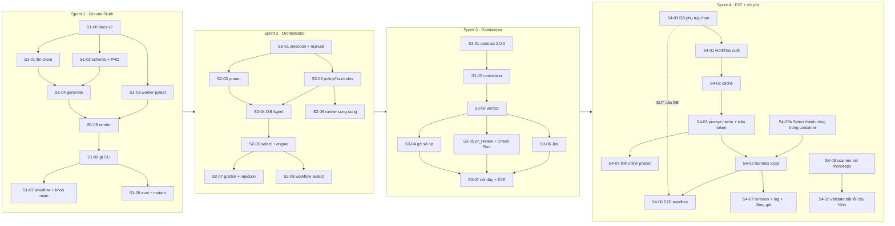

# Bộ prompt triển khai QC-Agent v2

Bộ prompt này thực thi `docs/implementation-plan.md` theo từng bước. Mỗi bước là **1 prompt = 1 phiên Claude Code mới = 1 PR**.

Chia nhỏ như vậy vì mỗi sprint có 8–11 task con. Gộp cả sprint vào một phiên thì phiên đó hết ngữ cảnh giữa chừng, còn PR thì quá to để review, trong khi `docs/core-rules.md` quy ước "một PR một việc, ≤ ~400 dòng". Các phiên không nhìn thấy nhau, nên phần chung (luật cứng, tên/đường dẫn chuẩn giữa các bước, cổng kiểm, mẫu báo cáo) được gom vào `_common.md`.

## Cách dùng

1. Mở phiên mới ở gốc repo, trên `main` mới nhất.
2. Gõ:
   ```
   Đọc docs/prompts/_common.md rồi thực hiện docs/prompts/sprint-1/S1-01-llm-client.md
   ```
3. Nếu phiên dừng ở mục **HỎI TRƯỚC**: trả lời, xem kế hoạch nó đưa ra, review diff, rồi bảo nó push/mở PR và merge.
4. Hết sprint: `Đọc docs/prompts/_common.md rồi thực hiện docs/prompts/dod-verify.md cho Sprint 1`.

Muốn gọi bằng slash command: copy file prompt vào `.claude/commands/<tên>.md`.

## Thứ tự và phụ thuộc



Chạy song song được, nếu có hai người hoặc hai worktree:
- **S1**: S1-03 chạy song song với S1-01/S1-02.
- **S2**: S2-03 chạy song song với S2-02; S2-06 chạy song song với S2-04/05.
- **S3**: S3-05 và S3-06 chạy song song sau S3-03.
- **S4**: S4-05b làm ngay (không phụ thuộc S4-01…03); nhánh onboarding S4-08 → S4-10 độc lập với phần còn lại. S4-05b và S4-05 cùng sửa `tools/run_reusable_locally.py` nên phải nối tiếp.

## Danh mục

| Prompt | Task trong plan | Cần thứ bên ngoài |
|---|---|---|
| [S1-00](sprint-1/S1-00-docs-v2.md) viết lại tài liệu v2 | S1.0 | tôi duyệt bảng delta |
| [S1-01](sprint-1/S1-01-llm-client.md) LLM client | S1.1 | — |
| [S1-02](sprint-1/S1-02-schemas-prd.md) schema GT + parse PRD | S1.2, S1.3 | — |
| [S1-03](sprint-1/S1-03-pytest-worker.md) worker `pytest` | S1.6 | — |
| [S1-04](sprint-1/S1-04-generate.md) sinh TC bằng LLM | S1.4 | — |
| [S1-05](sprint-1/S1-05-render.md) render tất định | S1.5 | — |
| [S1-06](sprint-1/S1-06-gt-cli.md) `qc-agent gt …` + HITL | S1.7, S1.8 (CLI) | — |
| [S1-07](sprint-1/S1-07-hitl-workflow-lock.md) workflow GT + khoá `.qc-agent/` | S1.8 (workflow), S1.9 | repo thật để kiểm tay (có thể dời sang S4-06) |
| [S1-08](sprint-1/S1-08-eval-mutants.md) mutant + golden + eval | S1.10 | QA gán nhãn golden; API key cho lượt đo thật |
| [S2-01](sprint-2/S2-01-selection-manual.md) `selection.json` + trigger manual | S2.1 (+ khung S2.6) | — |
| [S2-02](sprint-2/S2-02-policy-floor-rules.md) policy, floor, path rules | S2.3, S2.5 (lớp selector) | — |
| [S2-03](sprint-2/S2-03-pruner.md) pruner | S2.2 | — |
| [S2-04](sprint-2/S2-04-diff-agent.md) Diff Agent | S2.4 | — |
| [S2-05](sprint-2/S2-05-select-cmd-engine.md) `qc-agent select` + engine + report | S2.5 (lớp core), S2.6 | — |
| [S2-06](sprint-2/S2-06-parallel-runner.md) runner song song | S2.7 | — |
| [S2-07](sprint-2/S2-07-golden-injection-eval.md) golden set + injection + eval | S2.8, S2.9 | QA gán nhãn; API key |
| [S2-08](sprint-2/S2-08-workflow-select.md) bước Select trong CI | S2.10 | — |
| [S3-01](sprint-3/S3-01-contract-v2.md) contract 2.0.0 | S3.1 | approval của nhóm core |
| [S3-02](sprint-3/S3-02-normalizer.md) chuẩn hoá finding + policy severity | S3.2 | — |
| [S3-03](sprint-3/S3-03-gatekeeper-verdict.md) gatekeeper + verdict + exit code | S3.3 | tôi chọn cách xử lý cột `jobs.gate_verdict` |
| [S3-04](sprint-3/S3-04-remove-debt.md) gỡ sổ nợ, coverage-debt → Low | S3.4, S3.5 | — |
| [S3-05](sprint-3/S3-05-pr-review-checkrun.md) inline review + Check Run | S3.6, S3.7 | — |
| [S3-06](sprint-3/S3-06-jira.md) đồng bộ Jira | S3.8 | — |
| [S3-07](sprint-3/S3-07-wiring-e2e.md) nối dây CI, web, E2E harness | phần "File sửa" còn lại của S3 | — |
| [S4-09](sprint-4/S4-09-sut-with-database.md) dịch vụ DB phụ tuỳ chọn | S4.9 | loại DB/secret của SUT pilot (nếu có) |
| [S4-01](sprint-4/S4-01-workflows-final.md) workflow cuối + caller | S4.1 | — |
| [S4-02](sprint-4/S4-02-select-gt-cache.md) cache Select + GT | S4.2 | — |
| [S4-03](sprint-4/S4-03-prompt-cache-token-cap.md) prompt caching, trần token, chi phí | S4.3 | tôi quyết nếu prefix < ngưỡng cache |
| [S4-04](sprint-4/S4-04-pruner-tuning.md) tinh chỉnh pruner + `eval_cost` | S4.4 | API key |
| [S4-05b](sprint-4/S4-05b-select-success-container.md) Select thành công trong container | S4.5b | Docker |
| [S4-05](sprint-4/S4-05-local-harness.md) harness trọn chuỗi | S4.5 | Docker |
| [S4-06](sprint-4/S4-06-e2e-sandbox.md) E2E trên repo sandbox | S4.6 (+ kiểm tay DoD S1) | repo sandbox public/gói trả phí, Jira sandbox, API key, xác nhận câu hỏi #3 |
| [S4-07](sprint-4/S4-07-runbook-logs-packaging.md) runbook, log, đóng gói | S4.7 + file đóng gói | — |
| [S4-08](sprint-4/S4-08-init-scanner-monorepo.md) scanner `init` cho monorepo | S4.8 | — |
| [S4-10](sprint-4/S4-10-validate-config-errors.md) `validate` bắt lỗi cấu hình | S4.10 | — |
| [dod-verify](dod-verify.md) nghiệm thu một sprint | DoD từng sprint | tuỳ sprint |

## Hiệu chỉnh so với plan (đã áp vào các prompt)

Tìm ra khi đối chiếu plan với code và với API thật (tài liệu Claude API, cập nhật 2026-09-25):

1. **`claude-sonnet-5` trả 400 nếu request có `temperature`**, vì model này đã bỏ sampling params. S1.1 ghi "`temperature=0`", nên S1-01 chỉ gửi `temperature: 0` cho model cho phép tham số này (Haiku 4.5). Tính tái lập dựa vào fixture và render tất định; số đo LLM thật lấy median 3 lần, đúng như plan đã tính. Cũng không gửi `budget_tokens` (400 trên Sonnet 5).
2. **Tool schema ở chế độ `strict`** bắt buộc `additionalProperties: false` ở mọi object và không hỗ trợ `minLength/maxLength/minimum/maximum/multipleOf`. Vì vậy phải gửi một "wire schema" đã rút gọn và validate đầy đủ bằng `jsonschema` phía client. Hệ quả: `rationale` trong tool của Diff Agent là mảng `[{worker, reason}]`, được đổi thành map khi ghi `selection.json`.
3. **Image build bằng `uv sync --no-dev`**, nên không có `pytest`. Worker `pytest` sẽ probe hỏng, và gate FAIL vì `on_skipped_gate_task: fail`. S1-03 chuyển `pytest` sang dependency chính (cùng phiên bản đang ghim trong `uv.lock`).
4. **`noteboard` chưa có suite `sast`/`secrets`** (`blocking_suites: [api-contract, ai-eval]`), nên floor không có gì để chạy. S2-02 thêm hai suite này, cập nhật policy, và giữ job `image-e2e` của `ci.yml` đúng hai kết quả: sạch = 0, lỗi = 1.
5. **"11 chỗ phát `high`"**: grep thực tế ra 10 file phát hoặc ánh xạ `high`, cộng thêm `coverage_debt_adapter` (file này phát `low` và được sửa ở S3.5). Ngoài ra `threshold.py` gắn `high` cho mọi assertion fail. S3-01 grep lại toàn repo thay vì tin danh sách trong plan.
6. **"Phần 1" (S1.0) và "§5.3 cũ" không có trong repo.** "§5.3 cũ" là `docs/architecture.md` §5.3, chỗ chứa ví dụ prompt injection. S1-00 tự dựng bảng delta kiến trúc từ plan và SRS, rồi hỏi bạn duyệt trước khi sửa. Ví dụ injection được giữ lại để S2-07 dùng.
7. **Diff của PR phải lấy từ merge-base** (`base...head`), không phải `base..head`; nếu không, diff sẽ lẫn commit mới của nhánh đích. Vì vậy bước Select cần `fetch-depth: 0`.
8. **PR mở bằng `GITHUB_TOKEN` không kích hoạt workflow `pull_request`.** CI `gt validate` trên PR sinh GT chỉ chạy khi QA push commit (vẫn đúng quy trình, vì QA phải sửa `draft→approved`), hoặc khi dùng token của GitHub App/PAT. S1-07 ghi điều này vào tài liệu.
9. **`count_tokens` cũng gửi nội dung ra ngoài**, nên phải ghi egress như một lời gọi LLM.
10. **Strict mode không cho object mở**, nên catalog GT (map tự do cho `query`/`headers`/`path_params`/`capture`/`json`) không gửi thẳng cho LLM được. `schemas/ground_truth.json` có hai dạng: **catalog** (QA đọc/sửa YAML tự nhiên) và **emit** (`$defs/emit_test_cases`: map → mảng `{name, value}`, `json` → chuỗi JSON). S1-04 chuyển emit → catalog bằng code tất định. `client.wire_schema` từ chối object tự do thay vì âm thầm siết thành `{}`. Hình dạng `steps[]` (gói `request`/`expect` để `flow` dùng chung) vẫn như đề xuất của S1-02.
11. **SUT sạch trả 500 với id toàn chữ số ≥ 20 ký tự** (`sqlite3` tràn số nguyên, `toyapp/app.py: _get`), dù BUG-1 tắt. PRD mẫu vì thế chỉ dùng id chữ dài hoặc id 17–19 chữ số. Đây là lỗi có sẵn của SUT tham chiếu, chưa sửa (ngoài phạm vi S1-02).
12. **`generate` lệch prompt S1-04 ở bốn chỗ nhỏ** (đã ghi trong docstring `groundtruth/generate.py`):
    - **Khoảng mã HTTP 100–599** được nới trong schema gửi cho tool và kiểm lại **từng TC** (`_convert`): mã sai chỉ làm mất TC đó thay vì làm hỏng cả lời gọi và tốn lần sửa. Schema catalog vẫn giữ `minimum`/`maximum`, và `generate` validate catalog cuối cùng.
    - **Timeout mặc định 300s** (`max(QC_LLM_TIMEOUT_S, 300)`): request non-streaming 16k token thì API im lặng tới khi xong, nên read-timeout 120s của client làm hỏng lần sinh hợp lệ. Truyền `timeout_s=` để đổi.
    - **`generate(..., source=None, timeout_s=None)`**: thêm `source` (chuỗi ghi vào `prd.source` của catalog, S1-06 truyền đường dẫn PRD; mặc định là `prd_id`) vì `ParsedPRD` không giữ đường dẫn.
    - **Sai kiểu lỗi**: mọi lỗi (thiếu khoá, egress, HTTP, `refused`, sai schema sau lần sửa, PRD không có AC) đều là `GTError(kind)` để CLI chỉ bắt một loại. Chỉ `bad_output` được sửa một lần. `usage` trả về là của lời gọi thành công; lời gọi hỏng đã nằm trong log `llm.call` của client.
13. **`render` (S1-05) chốt những điểm prompt để ngỏ** (docstring `groundtruth/render.py` và mẫu `gt-conftest.py.tmpl`):
    - **TC thuộc story nào**: theo `ac_refs[0]` (cùng AC quyết định `tc_id`). TC `approved` không gắn được vào story nào, hoặc story đó không có `test_<story>.py`, thì runtime **thoát mã 4** (`error`) thay vì lặng lẽ bỏ qua; catalog hỏng hoặc thiếu `APP_BASE_URL` cũng mã 4. Các kiểm này nằm ở `pytest_sessionstart`: `pytest.exit` trong lúc collect bị pytest tính là lỗi collect (mã 2).
    - **Story không có TC approved** không sinh test nào (bị gỡ khỏi collection, không đếm là skipped). Nếu không, `pytest.tests >= 1` sẽ xanh với toàn skipped. Không có TC approved nào cả thì pytest thoát 5 và suite `fail`: gate rỗng không xanh.
    - **Ngữ nghĩa assertion** (prompt chưa nêu): `eq`/`ne` so kiểu JSON (`true` ≠ `1`); `ne`, `contains`, `len_*`, `type` **yêu cầu path tồn tại** (thiếu path thì fail, không thành "khác nhau"); `exists` đếm cả `null`; `{{var}}` đứng nguyên một mình trong chuỗi JSON giữ kiểu của giá trị đã capture, còn lại nội suy thành chuỗi.
    - **module-map**: `scan.py` không biết file khai báo route, nên `paths` là placeholder `TODO-route-files-of-<module>` kèm `qc-agent:todo VERIFY`; tên module lấy từ segment tĩnh đầu tiên của path trong catalog ∪ `Analysis.get_paths` (không có segment tĩnh thì `root`).
    - **Thứ tự khoá tất định**: catalog, request và assertion xếp theo thứ tự cố định; map (`query`, `headers`, `path_params`, `capture`) và body `json` xếp theo khoá, để đầu ra không phụ thuộc thứ tự dict nhập vào. `render` giữ nguyên `status` của từng TC (để `gt regen` giữ được thứ QA đã duyệt); file `.py` không phụ thuộc status.
    - **Regex `$` của schema** chấp nhận một `\n` ở cuối id (cách Python xử lý `$`). Không sửa schema ở đây; `render` chặn lại bằng `fullmatch` trước khi đưa `story_id` vào mã.
14. **`gt` CLI (S1-06) chốt những điểm prompt để ngỏ** (docstring `groundtruth/{cli,check,merge}.py`):
    - **Ba mức của `gt validate`**: lỗi (exit 1) / cảnh báo (exit 0) / không phán được (exit 3). Hai luật của schema là "catalog `approved` thì mọi TC phải đã duyệt" và "`rejected` cần `rejected_reason`"; `validate` báo chúng bằng exit 1 (lỗi HITL) chứ không phải exit 3, nên kiểm schema chạy trên bản đã nới hai luật đó.
    - **TC trỏ tới AC không có trong catalog**: lỗi nếu TC còn `draft`; **cảnh báo** nếu `approved`/`rejected` (đó là trường hợp PRD đã xoá AC, prompt yêu cầu exit 0). Hệ quả cần biết: TC `approved` có AC đầu tiên đã mất làm runtime `pytest` thoát mã 4 (gate `error`) cho tới khi QA sửa `ac_refs` hoặc chuyển `rejected`; cảnh báo nói rõ điều này.
    - **`regen` chỉ sở hữu file máy sinh**: catalog và `tests_gt/*`. `module-map.yaml`, `gt-functional.yaml`, `api-contract.yaml` thuộc về người sau lần `generate` đầu nên không bị ghi đè. `test_<story>.py` do máy sinh mà story đã bị xoá khỏi PRD thì bị xoá (chỉ file có dấu `qc-agent:generated gt`); file lạ trong `tests_gt/` không bị xoá mà bị `validate` báo drift.
    - **Comment YAML do QA viết trong `test-cases.yaml` không sống qua `regen`** (catalog được nạp rồi ghi lại); mọi TC thì giữ nguyên từng khoá/giá trị (test so bản `yaml.safe_dump` từng entry). QA nên ghi chú vào trường `notes` của TC.
    - **Lý do `uncovered_acs` do người sửa thắng lý do mới của LLM**; AC chỉ còn TC `rejected` được tính là chưa có TC (cảnh báo mồ côi) vì loại một TC không làm AC hết cần kiểm.
    - **Egress mặc định** ở `$QC_RUNS_DIR/gt` (tức `./runs/gt`), bị từ chối nếu nằm dưới `<sut>/.qc-agent/`. Workflow S1-07 nên truyền `--egress-dir` ra ngoài cây làm việc để `git add` không kéo nó vào PR.
    - **Không có tuỳ chọn policy egress ở CLI**: `LogOnlyPolicy` là mặc định; test `deny` thay lớp này bằng monkeypatch. Cấu hình policy thật nằm ở S3/S4.
15. **Workflow Ground-Truth và khoá QA (S1-07) chốt những điểm prompt để ngỏ** (`qc-groundtruth.reusable.yml`, `docs/groundtruth.md`):
    - **Tên nhánh lấy từ `gt info`**: lệnh mới `qc-agent gt info --prd FILE` (offline, không LLM) in `prd_id`/`sha256`/số story-AC. Workflow cần tên nhánh *trước khi* sinh (để xếp lên nhánh bot đã có), nên không thể lấy `prd_id` từ summary sau khi sinh như prompt gợi ý.
    - **Nhiều PRD một lần push**: job `select` chọn các PRD vừa đổi khớp glob (tối đa 5) thành matrix, job `generate` chạy tuần tự (`max-parallel: 1`), mỗi PRD một nhánh/PR. Phần shell dùng `python3` (có sẵn trên runner), không dùng `jq`.
    - **Không force-push**: nhánh bot đã có thì bản mới xếp lên trên (checkout nhánh đó, lấy PRD mới từ nhánh gốc, `regen`, commit thường, push `HEAD:refs/heads/<nhánh>`). Prompt cho phép force-push lên nhánh bot; cách này an toàn hơn vì không bao giờ ghi đè sửa của QA, đổi lại push bị từ chối (job đỏ) nếu QA đẩy đúng lúc chạy.
    - **PR đã có thì comment, không sửa mô tả** (QA có thể đã sửa). Thân PR do `groundtruth/pr_body.py` dựng từ summary (làm sạch bằng `clean_md`), chạy trong image.
    - **`validate` chạy `--network none`, workspace chỉ-đọc, không secret**, và bỏ qua PR không đụng `.qc-agent/ground-truth/`.
    - **`init` luôn sinh CODEOWNERS + `qc-groundtruth.yml`** (thiếu `--qa-team` thì `qc-agent:todo`), nên `qc-agent validate` của repo đã `init` sẵn sẽ đỏ tới khi điền team QA; các test cũ dùng `init` được truyền `qa_team`. CODEOWNERS có sẵn ở `.github/`, gốc hoặc `docs/` (theo thứ tự ưu tiên của GitHub) thì vùng được nối vào **cuối** file (quy tắc cuối thắng).
    - **`tools/protect_ground_truth.py` gộp, không ghi đè**: đổi định dạng GET sang PUT (kể cả `contexts` cũ sang `checks`), chỉ nâng `require_code_owner_reviews` và số duyệt tối thiểu. Không đụng `enforce_admins`. **Chưa chạy trên repo thật.**
    - **Harness**: `tools/run_reusable_locally.py --job validate` chạy job `validate` của workflow mới (test `tests/test_gt_workflow_local.py`, cần `QC_TEST_DOCKER_IMAGE` có lệnh `gt`). Job `select`/`generate` cần GitHub thật (checkout, `gh`); phần shell của chúng được kiểm bằng git thật ở `tests/test_workflow_static.py`. `find_bash()` giờ tìm được Git Bash cài theo người dùng (bash.exe trong WindowsApps là WSL).
    - **Đỏ có chủ ý khi PRD bỏ một AC**: TC `approved` trỏ AC đã mất làm gate `error` (exit 4) cho tới khi QA xử lý; `gt validate` chỉ cảnh báo. Giữ nguyên theo quyết định của bạn để QA nhận ra PRD đã bỏ một tính năng.
16. **Mutant, golden, bộ GT đã duyệt và đo đạc (S1-08) chốt những điểm prompt để ngỏ** (`toyapp/app.py`, `noteboard-golden.yaml`, `tools/eval_groundtruth.py`):
    - **BUG-9 là "GET /notes trả mảng rỗng", không phải "bỏ sót ghi chú mới nhất"**: bộ assertion đóng của S1-02 không tham chiếu được biến đã `capture` (không có kiểu `$[*].id chứa {{note_id}}`), và SUT có trạng thái dùng chung giữa các TC, nên `len_gte 1` không phân biệt "thiếu một phần tử" với "đủ". Bản đầu (bỏ sót phần tử mới nhất) sống sót ở lần đo thật, nên đã đổi. Giới hạn này đáng cân nhắc khi mở rộng bộ assertion (vd. `contains` trên mảng đối tượng theo khoá).
    - **Kiểm bằng chạy thật**: với `QC_BUGS=<k>`, k = 4…13, suite `api-contract` (Schemathesis) vẫn **xanh** (exit 0) cả 10 mutant; `QC_BUGS=1` (đối chứng) thì đỏ (exit 1). BUG-4/5 đổi luôn schema OpenAPI của SUT (minLength/maxLength), nên request "sai PRD" vẫn hợp lệ theo schema của chính SUT.
    - **Cổng noteboard sau khi bật `gt-functional`** (`qc-agent run --project noteboard --mode pr`, cục bộ): sạch → 0; BUG-2 (chỉ có ở frontend) → 0; BUG-1, BUG-3, `1,3` → 1; BUG-4…13 → 1. Danh sách `blocking_suites` của noteboard là danh sách thay thế nên giữ đủ `api-contract` và `ai-eval`; `_default.yaml` không đổi.
    - **`image-e2e` chỉ mô phỏng**, chưa chạy CI thật: mạng công ty làm `docker build` lỗi TLS, nên dùng một image tạm (image cũ + mã, schemas, configs, workers hiện tại, ngoài repo) với đúng lệnh của job: sạch → 0, `1,3` → 1, `8` → 1, task `t-030` chạy bằng worker `pytest`. Một điều đáng biết: image thiếu manifest `workers/pytest.yaml` thì `t-030` bị *skipped* và gate đỏ (đúng theo `on_skipped_gate_task: fail`), nên khi build image thật phải chắc worker `pytest` có trong image.
    - **Bộ đã duyệt là dữ liệu giả lập, không phải QA thật**: sinh bằng `gt generate` (FakeAnthropic + fixture S1-04), rồi dev đóng vai QA: `rejected` 2 TC kèm lý do (trùng `api-contract`; cùng lớp tương đương), thêm 4 TC `origin: qa` (biên độ dài unicode, xoá hai lần giữ ghi chú khác, hai ghi chú mỗi cái đúng nội dung, biên nhỏ nhất của summary), điền `module-map`, đặt `approved`; `AC-1.8`/`AC-3.5` (giao diện) vào `uncovered_acs`. Nội dung TC của LLM không bị sửa (test đối chiếu với bản sinh lại). `qc-agent gt validate` exit 0, không cảnh báo.
    - **Golden do dev gán** (`labeled_by: "dev — CẦN QA DUYỆT"`, plan §3.4 đòi QA gán): công cụ in nhắc mỗi lần chạy.
    - **Số đo ở chế độ `fake` chỉ kiểm đường ống**: response giả do dev soạn tay nên coverage 100% và TC xanh 100% không nói gì về chất lượng LLM. Đo thật (median 3 lần) để dành cho phiên `dod-verify` và **cần bạn đồng ý** (tốn tiền, gửi PRD ra ngoài).
    - **Noteboard fixture giờ có `.github/CODEOWNERS`** (vùng do `init` sinh, team giả `@Muteen-Felix/qa-team`): vì `qc-agent validate` đòi CODEOWNERS khi repo có Ground-Truth.
17. **Code đã có những thứ prompt S4 viết như việc mới** (kiểm 2026-10-06, áp vào S4-02/03/07):
    - Provider **Gemini** trong `llm/client.py` (chọn theo tiền tố `gemini-*`, retry/fallback riêng); `.env.example` đặt mẫu Gemini. `cache_control` và `count_tokens` chỉ áp cho Claude; `est_usd` của Gemini là `null`.
    - **GT agent** (`llm/agent_loop.py`, `groundtruth/agent.py`, `--agent`) đã gắn `cache_control` và có ngân sách riêng (`QC_GT_AGENT_MAX_*`), nên trần `QC_LLM_MAX_INPUT_TOKENS` của S4-03 không áp cho agent.
    - **Bảng giá** đã có ở `agent_loop.PRICES`; S4-03 chuyển nó sang `llm/prices.py`, không tạo bảng thứ hai. `core/report.py: _cost_line` đã có, S4-03 mở rộng thay vì thêm dòng.
18. **`schemas/selection.json` đã có** `source: cache` và `fallback_reason: token_cap`; thêm `cache_hit` vào khối `llm` (`additionalProperties: false`) là sửa schema dữ liệu, không phải contract.
19. **Cache GT chỉ áp cho bộ sinh một lời gọi** (đề xuất, chốt ở S4-02): agent đọc mã nguồn nên cache theo PRD sẽ trả kết quả cũ khi code đổi.
20. **Đo token của pruner tách FULL SET** (S4-04), cùng công thức `eval_selector` đã sửa 2026-10-06: diff đi FULL SET không gọi LLM nên không tính vào median giảm token. Baseline recall là số đo thật `eval/selector-real.json` (97,1%), không chỉ ngưỡng 90%.
21. **S4.9 chọn phương án (b): dịch vụ DB phụ tuỳ chọn trong reusable workflow** (quyết định của Felix, 2026-10-06), khác đề xuất (a)-trước ban đầu. DB là tuỳ chọn: SUT không cần DB giữ đường chạy cũ; không mặc định PostgreSQL; bí mật qua secret, không qua `sut_env`. Vì thêm input cho workflow nên S4-09 làm **trước** S4-01. `docs/implementation-plan.md` không sửa trong đợt cập nhật prompt này.
22. **Thứ tự Jira → Report trong `qc-gate.reusable.yml` là có chủ ý** (S4-01): Report dựng Check Run nên phải sau Jira để hiện cảnh báo Jira 401/503.

## Cần bạn quyết (prompt sẽ dừng lại hỏi đúng chỗ)

1. **Cột `jobs.gate_verdict`** là `String(8)` với `CHECK IN ('PASS','YELLOW','FAIL')` (`jobs/models.py`). Giá trị `PASSED_WITH_WARNINGS` (20 ký tự) và `BLOCKED` không lưu được, nên executor và ingest sẽ lỗi. Hai cách:
   - (a) migration `0006` mở rộng cột và CHECK. Không drop gì, nên hợp quyết định #4. **Đây là cách đề xuất.**
   - (b) ánh xạ về giá trị cũ ở chỗ ghi vào DB.

   → hỏi ở S3-03.
2. **Prompt caching của Diff Agent.** Haiku 4.5 chỉ cache prefix từ **4096 token** trở lên (Sonnet 5 là 1024). Prefix tĩnh của `noteboard` (system + module-map + catalog) nhiều khả năng dưới 4096, nên DoD S4 "`cache_read_input_tokens > 0` từ lần gọi 2" có thể không đạt trên repo này. S4-03 sẽ đo bằng `count_tokens` rồi hỏi bạn chọn một trong ba: chấp nhận N/A với repo nhỏ, kiểm trên GT generator, hay đổi model.
3. **`rule_id` để override severity.** Contract hiện chưa có trường rule; Semgrep đang nhét rule vào `title`. Đề xuất dùng quy ước `detected_by: "<tool>:<rule_id>"`, vì đã có tiền lệ `coverage-debt:<kind>` và `threshold:<metric>`. Nếu muốn thêm field riêng thì phải gộp vào **cùng** lần nâng 2.0.0 → hỏi ở S3-01.
4. **`on_skipped_gate_task: yellow` sau khi bỏ YELLOW.** Đề xuất:
   - `yellow` → cảnh báo Low, tức `PASSED_WITH_WARNINGS`;
   - `fail` → `BLOCKED`;
   - task lỗi hoặc bị skip ở lane discovery thì không chặn.

   → hỏi ở S3-02.

Ghi chú về model: plan chốt `claude-sonnet-5` / `claude-haiku-4-5-20251001`, nên các prompt giữ nguyên. `claude-sonnet-5-5` cùng giá với Sonnet 5 ($2/$10 mỗi MTok) nhưng **từ chối forced `tool_choice`** (trả 400). Nếu sau này đổi `QC_GT_MODEL` sang model đó thì client phải chuyển sang `tool_choice: auto` + `strict: true`; S1-01 ghi chú điều này trong docstring.

Rủi ro còn lại do quyết định #1 (floor chỉ gồm secrets + sast): trong trường hợp xấu nhất, prompt injection làm Diff Agent bỏ sót worker ngoài floor ở những file chưa có trong module-map. Cách giảm nhẹ:
- kết quả chọn = floor ∪ rules(module-map) ∪ LLM;
- `full_set_paths`;
- bộ test injection ở S2-07.

S1-00 ghi rủi ro này vào `architecture.md`.

## Phát hiện từ S1-03 (worker `pytest`, đã kiểm bằng thực nghiệm)

- **Cấu hình pytest của repo SUT có thể làm gate xanh giả.** `addopts = "--deselect <test đang fail>"` trong `pyproject.toml`, hoặc một `conftest.py` ở gốc repo lọc bớt test, làm test GT đang fail biến mất mà `pytest.tests >= 1` vẫn đạt. Hai file đó nằm ngoài `.qc-agent/**` nên CODEOWNERS không khoá. argv của worker cố định theo plan, nên **S1-05 phải sinh `tests_gt/pytest.ini`** (`[pytest]`, `addopts =`): nó nằm trong thư mục QA khoá và khiến pytest coi thư mục đó là rootdir và confcutdir, nên không đọc cấu hình hay conftest của SUT. `gt validate` (S1-06) bắt việc xoá hoặc sửa file này vì nó thuộc nhóm file sinh ra được so lại. Adapter còn **ép fail-closed**: thư mục trong `inputs.paths` thiếu `pytest.ini` thì `build_cmd` ném lỗi và task ra `error`, không bao giờ chạy để rồi xanh giả (quyết định: chọn lớp này thay cho `-c`/`--confcutdir`/`--rootdir` vì không đổi argv của plan). Test `test_integration_a_pytest_ini_next_to_the_tests_shields_them_from_sut_config` giữ cách bố trí này.
- **Tắt autoload plugin là bắt buộc, không chỉ đề phòng.** Venv của image có 9 plugin `pytest11` (gồm `pytest-rerunfailures`, `xdist`, `deepeval`, `schemathesis`). Nạp hết làm pytest con chậm ~5 lần (4,6 giây so với 0,9 giây cho một test) và `rerunfailures` có thể chạy lại test fail, trái luật "không retry `fail`". Adapter đặt `PYTEST_DISABLE_PLUGIN_AUTOLOAD=1` và `PYTEST_ADDOPTS` rỗng; conftest runtime của S1-05 chỉ được dùng `httpx`, `PyYAML`, `pytest`.
- **Lỗi collect (import hỏng, cú pháp sai) làm pytest thoát với exit 2, không phải 1**, và dừng cả phiên. Theo plan, exit 2 là `error` (gate đỏ nhãn hạ tầng), nên một file test GT hỏng không bao giờ ra `pass` hay `fail` giả.
- **Một test fail kèm lỗi teardown sinh hai `<testcase>` cùng tên** trong JUnit (một `failure`, một `error`); `xfail` được ghi là `<skipped>`. Adapter đếm theo phần tử `<testcase>` và cho `finding_id` hậu tố `-2` khi trùng.

## Chuẩn bị bên ngoài (plan §3), dùng ở đâu

| Thứ cần chuẩn bị | Bước dùng tới |
|---|---|
| Repo sandbox GitHub (**public hoặc gói trả phí**: GitHub Free + private không có branch protection) | S1-07 (kiểm tay, đã dời sang S4-06 kịch bản B), S4-06 |
| Jira sandbox + `user_map` | S3-06/07 dùng fake Jira; S4-06 dùng Jira thật |
| `ANTHROPIC_API_KEY` có trần ngân sách | S1-08, S2-07, S4-03/04/06 (chỉ các lượt đo thật) |
| QA gán nhãn golden set | S1-08 (`noteboard-golden.yaml`), S2-07 (`labels.yaml`) |
| Approval của nhóm core cho contract 2.0.0 | S3-01 |
| Xác nhận bằng văn bản câu hỏi #3 (được gửi PRD/diff/mã nguồn qua LLM ngoài) | mọi lượt LLM thật, nhất là S4-06 |
| Loại DB + secret của SUT pilot cần DB | S4-09, S4-06 (nếu dùng SUT đó) |
