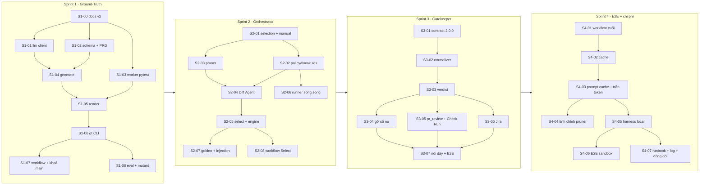

# Bộ prompt triển khai QC-Agent v2

Bộ prompt này thực thi `docs/implementation-plan.md` theo từng bước. Mỗi bước là **1 prompt = 1 phiên Claude Code mới = 1 PR**.

Chia nhỏ như vậy vì mỗi sprint có 8–11 task con. Gộp cả sprint vào một phiên thì phiên đó hết ngữ cảnh giữa chừng, còn PR thì quá to để review, trong khi `docs/core-rules.md` quy ước "một PR một việc, ≤ ~400 dòng". Các phiên không nhìn thấy nhau, nên phần chung (luật cứng, tên/đường dẫn chuẩn giữa các bước, cổng kiểm, mẫu báo cáo) được gom vào `_common.md`.

## Cách dùng

1. Mở phiên mới ở gốc repo, trên `main` mới nhất.
2. Gõ:
   ```
   Đọc docs/prompts/_common.md rồi thực hiện docs/prompts/sprint-1/S1-01-llm-client.md
   ```
3. Nếu phiên dừng ở mục **HỎI TRƯỚC**: trả lời, xem kế hoạch nó đưa ra, review diff, rồi bảo nó push/mở PR và merge.
4. Hết sprint: `Đọc docs/prompts/_common.md rồi thực hiện docs/prompts/dod-verify.md cho Sprint 1`.

Muốn gọi bằng slash command: copy file prompt vào `.claude/commands/<tên>.md`.

## Thứ tự và phụ thuộc



Chạy song song được, nếu có hai người hoặc hai worktree:
- **S1**: S1-03 chạy song song với S1-01/S1-02.
- **S2**: S2-03 chạy song song với S2-02; S2-06 chạy song song với S2-04/05.
- **S3**: S3-05 và S3-06 chạy song song sau S3-03.

## Danh mục

| Prompt | Task trong plan | Cần thứ bên ngoài |
|---|---|---|
| [S1-00](sprint-1/S1-00-docs-v2.md) viết lại tài liệu v2 | S1.0 | tôi duyệt bảng delta |
| [S1-01](sprint-1/S1-01-llm-client.md) LLM client | S1.1 | — |
| [S1-02](sprint-1/S1-02-schemas-prd.md) schema GT + parse PRD | S1.2, S1.3 | — |
| [S1-03](sprint-1/S1-03-pytest-worker.md) worker `pytest` | S1.6 | — |
| [S1-04](sprint-1/S1-04-generate.md) sinh TC bằng LLM | S1.4 | — |
| [S1-05](sprint-1/S1-05-render.md) render tất định | S1.5 | — |
| [S1-06](sprint-1/S1-06-gt-cli.md) `qc-agent gt …` + HITL | S1.7, S1.8 (CLI) | — |
| [S1-07](sprint-1/S1-07-hitl-workflow-lock.md) workflow GT + khoá `.qc-agent/` | S1.8 (workflow), S1.9 | repo thật để kiểm tay (có thể dời sang S4-06) |
| [S1-08](sprint-1/S1-08-eval-mutants.md) mutant + golden + eval | S1.10 | QA gán nhãn golden; API key cho lượt đo thật |
| [S2-01](sprint-2/S2-01-selection-manual.md) `selection.json` + trigger manual | S2.1 (+ khung S2.6) | — |
| [S2-02](sprint-2/S2-02-policy-floor-rules.md) policy, floor, path rules | S2.3, S2.5 (lớp selector) | — |
| [S2-03](sprint-2/S2-03-pruner.md) pruner | S2.2 | — |
| [S2-04](sprint-2/S2-04-diff-agent.md) Diff Agent | S2.4 | — |
| [S2-05](sprint-2/S2-05-select-cmd-engine.md) `qc-agent select` + engine + report | S2.5 (lớp core), S2.6 | — |
| [S2-06](sprint-2/S2-06-parallel-runner.md) runner song song | S2.7 | — |
| [S2-07](sprint-2/S2-07-golden-injection-eval.md) golden set + injection + eval | S2.8, S2.9 | QA gán nhãn; API key |
| [S2-08](sprint-2/S2-08-workflow-select.md) bước Select trong CI | S2.10 | — |
| [S3-01](sprint-3/S3-01-contract-v2.md) contract 2.0.0 | S3.1 | approval của nhóm core |
| [S3-02](sprint-3/S3-02-normalizer.md) chuẩn hoá finding + policy severity | S3.2 | — |
| [S3-03](sprint-3/S3-03-gatekeeper-verdict.md) gatekeeper + verdict + exit code | S3.3 | tôi chọn cách xử lý cột `jobs.gate_verdict` |
| [S3-04](sprint-3/S3-04-remove-debt.md) gỡ sổ nợ, coverage-debt → Low | S3.4, S3.5 | — |
| [S3-05](sprint-3/S3-05-pr-review-checkrun.md) inline review + Check Run | S3.6, S3.7 | — |
| [S3-06](sprint-3/S3-06-jira.md) đồng bộ Jira | S3.8 | — |
| [S3-07](sprint-3/S3-07-wiring-e2e.md) nối dây CI, web, E2E harness | phần "File sửa" còn lại của S3 | — |
| [S4-01](sprint-4/S4-01-workflows-final.md) workflow cuối + caller | S4.1 | — |
| [S4-02](sprint-4/S4-02-select-gt-cache.md) cache Select + GT | S4.2 | — |
| [S4-03](sprint-4/S4-03-prompt-cache-token-cap.md) prompt caching, trần token, chi phí | S4.3 | tôi quyết nếu prefix < ngưỡng cache |
| [S4-04](sprint-4/S4-04-pruner-tuning.md) tinh chỉnh pruner + `eval_cost` | S4.4 | API key |
| [S4-05](sprint-4/S4-05-local-harness.md) harness trọn chuỗi | S4.5 | Docker |
| [S4-06](sprint-4/S4-06-e2e-sandbox.md) E2E trên repo sandbox | S4.6 | repo sandbox, Jira sandbox, API key |
| [S4-07](sprint-4/S4-07-runbook-logs-packaging.md) runbook, log, đóng gói | S4.7 + file đóng gói | — |
| [dod-verify](dod-verify.md) nghiệm thu một sprint | DoD từng sprint | tuỳ sprint |

## Hiệu chỉnh so với plan (đã áp vào các prompt)

Tìm ra khi đối chiếu plan với code và với API thật (tài liệu Claude API, cập nhật 2026-09-25):

1. **`claude-sonnet-5` trả 400 nếu request có `temperature`**, vì model này đã bỏ sampling params. S1.1 ghi "`temperature=0`", nên S1-01 chỉ gửi `temperature: 0` cho model cho phép tham số này (Haiku 4.5). Tính tái lập dựa vào fixture và render tất định; số đo LLM thật lấy median 3 lần, đúng như plan đã tính. Cũng không gửi `budget_tokens` (400 trên Sonnet 5).
2. **Tool schema ở chế độ `strict`** bắt buộc `additionalProperties: false` ở mọi object và không hỗ trợ `minLength/maxLength/minimum/maximum/multipleOf`. Vì vậy phải gửi một "wire schema" đã rút gọn và validate đầy đủ bằng `jsonschema` phía client. Hệ quả: `rationale` trong tool của Diff Agent là mảng `[{worker, reason}]`, được đổi thành map khi ghi `selection.json`.
3. **Image build bằng `uv sync --no-dev`**, nên không có `pytest`. Worker `pytest` sẽ probe hỏng, và gate FAIL vì `on_skipped_gate_task: fail`. S1-03 chuyển `pytest` sang dependency chính (cùng phiên bản đang ghim trong `uv.lock`).
4. **`noteboard` chưa có suite `sast`/`secrets`** (`blocking_suites: [api-contract, ai-eval]`), nên floor không có gì để chạy. S2-02 thêm hai suite này, cập nhật policy, và giữ job `image-e2e` của `ci.yml` đúng hai kết quả: sạch = 0, lỗi = 1.
5. **"11 chỗ phát `high`"**: grep thực tế ra 10 file phát hoặc ánh xạ `high`, cộng thêm `coverage_debt_adapter` (file này phát `low` và được sửa ở S3.5). Ngoài ra `threshold.py` gắn `high` cho mọi assertion fail. S3-01 grep lại toàn repo thay vì tin danh sách trong plan.
6. **"Phần 1" (S1.0) và "§5.3 cũ" không có trong repo.** "§5.3 cũ" là `docs/architecture.md` §5.3, chỗ chứa ví dụ prompt injection. S1-00 tự dựng bảng delta kiến trúc từ plan và SRS, rồi hỏi bạn duyệt trước khi sửa. Ví dụ injection được giữ lại để S2-07 dùng.
7. **Diff của PR phải lấy từ merge-base** (`base...head`), không phải `base..head`; nếu không, diff sẽ lẫn commit mới của nhánh đích. Vì vậy bước Select cần `fetch-depth: 0`.
8. **PR mở bằng `GITHUB_TOKEN` không kích hoạt workflow `pull_request`.** CI `gt validate` trên PR sinh GT chỉ chạy khi QA push commit (vẫn đúng quy trình, vì QA phải sửa `draft→approved`), hoặc khi dùng token của GitHub App/PAT. S1-07 ghi điều này vào tài liệu.
9. **`count_tokens` cũng gửi nội dung ra ngoài**, nên phải ghi egress như một lời gọi LLM.
10. **Strict mode không cho object mở**, nên catalog GT (map tự do cho `query`/`headers`/`path_params`/`capture`/`json`) không gửi thẳng cho LLM được. `schemas/ground_truth.json` có hai dạng: **catalog** (QA đọc/sửa YAML tự nhiên) và **emit** (`$defs/emit_test_cases`: map → mảng `{name, value}`, `json` → chuỗi JSON). S1-04 chuyển emit → catalog bằng code tất định. `client.wire_schema` từ chối object tự do thay vì âm thầm siết thành `{}`. Hình dạng `steps[]` (gói `request`/`expect` để `flow` dùng chung) vẫn như đề xuất của S1-02.
11. **SUT sạch trả 500 với id toàn chữ số ≥ 20 ký tự** (`sqlite3` tràn số nguyên, `toyapp/app.py: _get`), dù BUG-1 tắt. PRD mẫu vì thế chỉ dùng id chữ dài hoặc id 17–19 chữ số. Đây là lỗi có sẵn của SUT tham chiếu, chưa sửa (ngoài phạm vi S1-02).
12. **`generate` lệch prompt S1-04 ở bốn chỗ nhỏ** (đã ghi trong docstring `groundtruth/generate.py`):
    - **Khoảng mã HTTP 100–599** được nới trong schema gửi cho tool và kiểm lại **từng TC** (`_convert`): mã sai chỉ làm mất TC đó thay vì làm hỏng cả lời gọi và tốn lần sửa. Schema catalog vẫn giữ `minimum`/`maximum`, và `generate` validate catalog cuối cùng.
    - **Timeout mặc định 300s** (`max(QC_LLM_TIMEOUT_S, 300)`): request non-streaming 16k token thì API im lặng tới khi xong, nên read-timeout 120s của client làm hỏng lần sinh hợp lệ. Truyền `timeout_s=` để đổi.
    - **`generate(..., source=None, timeout_s=None)`**: thêm `source` (chuỗi ghi vào `prd.source` của catalog, S1-06 truyền đường dẫn PRD; mặc định là `prd_id`) vì `ParsedPRD` không giữ đường dẫn.
    - **Sai kiểu lỗi**: mọi lỗi (thiếu khoá, egress, HTTP, `refused`, sai schema sau lần sửa, PRD không có AC) đều là `GTError(kind)` để CLI chỉ bắt một loại. Chỉ `bad_output` được sửa một lần. `usage` trả về là của lời gọi thành công; lời gọi hỏng đã nằm trong log `llm.call` của client.

## Cần bạn quyết (prompt sẽ dừng lại hỏi đúng chỗ)

1. **Cột `jobs.gate_verdict`** là `String(8)` với `CHECK IN ('PASS','YELLOW','FAIL')` (`jobs/models.py`). Giá trị `PASSED_WITH_WARNINGS` (20 ký tự) và `BLOCKED` không lưu được, nên executor và ingest sẽ lỗi. Hai cách:
   - (a) migration `0006` mở rộng cột và CHECK. Không drop gì, nên hợp quyết định #4. **Đây là cách đề xuất.**
   - (b) ánh xạ về giá trị cũ ở chỗ ghi vào DB.

   → hỏi ở S3-03.
2. **Prompt caching của Diff Agent.** Haiku 4.5 chỉ cache prefix từ **4096 token** trở lên (Sonnet 5 là 1024). Prefix tĩnh của `noteboard` (system + module-map + catalog) nhiều khả năng dưới 4096, nên DoD S4 "`cache_read_input_tokens > 0` từ lần gọi 2" có thể không đạt trên repo này. S4-03 sẽ đo bằng `count_tokens` rồi hỏi bạn chọn một trong ba: chấp nhận N/A với repo nhỏ, kiểm trên GT generator, hay đổi model.
3. **`rule_id` để override severity.** Contract hiện chưa có trường rule; Semgrep đang nhét rule vào `title`. Đề xuất dùng quy ước `detected_by: "<tool>:<rule_id>"`, vì đã có tiền lệ `coverage-debt:<kind>` và `threshold:<metric>`. Nếu muốn thêm field riêng thì phải gộp vào **cùng** lần nâng 2.0.0 → hỏi ở S3-01.
4. **`on_skipped_gate_task: yellow` sau khi bỏ YELLOW.** Đề xuất:
   - `yellow` → cảnh báo Low, tức `PASSED_WITH_WARNINGS`;
   - `fail` → `BLOCKED`;
   - task lỗi hoặc bị skip ở lane discovery thì không chặn.

   → hỏi ở S3-02.

Ghi chú về model: plan chốt `claude-sonnet-5` / `claude-haiku-4-5-20251001`, nên các prompt giữ nguyên. `claude-sonnet-5-5` cùng giá với Sonnet 5 ($2/$10 mỗi MTok) nhưng **từ chối forced `tool_choice`** (trả 400). Nếu sau này đổi `QC_GT_MODEL` sang model đó thì client phải chuyển sang `tool_choice: auto` + `strict: true`; S1-01 ghi chú điều này trong docstring.

Rủi ro còn lại do quyết định #1 (floor chỉ gồm secrets + sast): trong trường hợp xấu nhất, prompt injection làm Diff Agent bỏ sót worker ngoài floor ở những file chưa có trong module-map. Cách giảm nhẹ:
- kết quả chọn = floor ∪ rules(module-map) ∪ LLM;
- `full_set_paths`;
- bộ test injection ở S2-07.

S1-00 ghi rủi ro này vào `architecture.md`.

## Phát hiện từ S1-03 (worker `pytest`, đã kiểm bằng thực nghiệm)

- **Cấu hình pytest của repo SUT có thể làm gate xanh giả.** `addopts = "--deselect <test đang fail>"` trong `pyproject.toml`, hoặc một `conftest.py` ở gốc repo lọc bớt test, làm test GT đang fail biến mất mà `pytest.tests >= 1` vẫn đạt. Hai file đó nằm ngoài `.qc-agent/**` nên CODEOWNERS không khoá. argv của worker cố định theo plan, nên **S1-05 phải sinh `tests_gt/pytest.ini`** (`[pytest]`, `addopts =`): nó nằm trong thư mục QA khoá và khiến pytest coi thư mục đó là rootdir và confcutdir, nên không đọc cấu hình hay conftest của SUT. `gt validate` (S1-06) bắt việc xoá hoặc sửa file này vì nó thuộc nhóm file sinh ra được so lại. Adapter còn **ép fail-closed**: thư mục trong `inputs.paths` thiếu `pytest.ini` thì `build_cmd` ném lỗi và task ra `error`, không bao giờ chạy để rồi xanh giả (quyết định: chọn lớp này thay cho `-c`/`--confcutdir`/`--rootdir` vì không đổi argv của plan). Test `test_integration_a_pytest_ini_next_to_the_tests_shields_them_from_sut_config` giữ cách bố trí này.
- **Tắt autoload plugin là bắt buộc, không chỉ đề phòng.** Venv của image có 9 plugin `pytest11` (gồm `pytest-rerunfailures`, `xdist`, `deepeval`, `schemathesis`). Nạp hết làm pytest con chậm ~5 lần (4,6 giây so với 0,9 giây cho một test) và `rerunfailures` có thể chạy lại test fail, trái luật "không retry `fail`". Adapter đặt `PYTEST_DISABLE_PLUGIN_AUTOLOAD=1` và `PYTEST_ADDOPTS` rỗng; conftest runtime của S1-05 chỉ được dùng `httpx`, `PyYAML`, `pytest`.
- **Lỗi collect (import hỏng, cú pháp sai) làm pytest thoát với exit 2, không phải 1**, và dừng cả phiên. Theo plan, exit 2 là `error` (gate đỏ nhãn hạ tầng), nên một file test GT hỏng không bao giờ ra `pass` hay `fail` giả.
- **Một test fail kèm lỗi teardown sinh hai `<testcase>` cùng tên** trong JUnit (một `failure`, một `error`); `xfail` được ghi là `<skipped>`. Adapter đếm theo phần tử `<testcase>` và cho `finding_id` hậu tố `-2` khi trùng.

## Chuẩn bị bên ngoài (plan §3), dùng ở đâu

| Thứ cần chuẩn bị | Bước dùng tới |
|---|---|
| Repo sandbox GitHub | S1-07 (kiểm tay, có thể dời), S4-06 |
| Jira sandbox + `user_map` | S3-06/07 dùng fake Jira; S4-06 dùng Jira thật |
| `ANTHROPIC_API_KEY` có trần ngân sách | S1-08, S2-07, S4-03/04/06 (chỉ các lượt đo thật) |
| QA gán nhãn golden set | S1-08 (`noteboard-golden.yaml`), S2-07 (`labels.yaml`) |
| Approval của nhóm core cho contract 2.0.0 | S3-01 |
